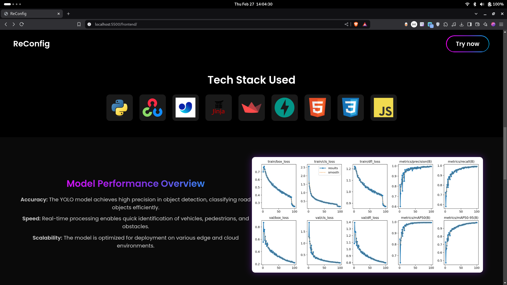
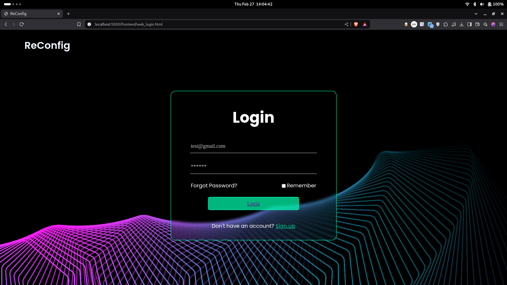
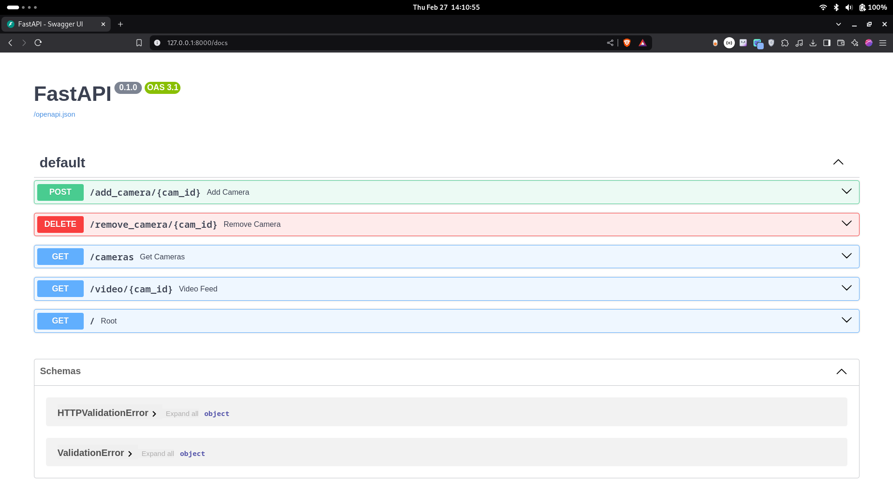

# 🖥️ YOLO Multi-Camera Panel

A real-time **YOLO Object Detection Dashboard** that allows users to view live video feeds and analyze object detection results using a trained YOLO model.

---
## Screenshots




### Demo Video
[Demo Video](assets/demo.mp4)

## 🚀 Features
- 🎥 **Live Video Streaming** - Displays real-time object detection feeds.
- 🧠 **Model Analysis** - Shows processed video frames with detected objects.
- 📱 **Responsive UI** - Works on both mobile and desktop.
- 🎨 **Modern Dark Theme** - Clean and intuitive user interface.

---

## 🛠️ Tech Stack
- **Frontend:** HTML, CSS, JavaScipt (Dark Themed UI)
- **Backend:** Python (FastAPI)
- **YOLO Model:** YOLOv4 / YOLOv5 for object detection

---

## 📌 Setup Instructions
### 🔹 **1. Clone the Repository**
```sh
git clone https://github.com/aaryansinhaa/yolo-multi-camera-panel.git
cd yolo-multi-camera-panel
```
### 🔹 **2. Install the Dependencies**
```sh
python -m venv venv
source venv/bin/activate  # On macOS/Linux
venv\Scripts\activate  # On Windows

pip install -r requirements.txt
```

### 🔹 **3. Start the Backend Server**
Ensure you have **FastAPI** running to serve the processed video frames.
```sh
cd server
python -m uvicorn main:app --reload
```

### 🔹 **4. Open the HTML File**
```
cd frontend
```
1. Run the page on local host
2. You will be redirected to the index.html, which is the landing page of the project.

---

## 📸 Usage
1. **Upload or stream a video** using the test panel.
2. **View real-time detection** on the model analysis section.
3. **Hover over images** for enhanced previews.

---

## 🤝 Contributions
Contributions are welcome! Feel free to:
1. Fork the repository
2. Make improvements
3. Submit a pull request 🚀

---

## 📄 License
This project is licensed under the **MIT License**.

---

## 📧 Contact
💬 If you have any questions, feel free to reach out:  
📧 Email: [sinhaaaryankumar@outlook.com](mailto:sinhaaaryankumar@outlook.com)  
🔗 LinkedIn: [Aaryan Kumar Sinha](www.linkedin.com/in/aaryankumarsinha)  

## 📌 Future Enhancements
- 🔹 **Multi-Camera Support**  
- 🔹 **Custom Trained Yolo Model**  
- 🔹 **Read-Time Object Detection**  

---
